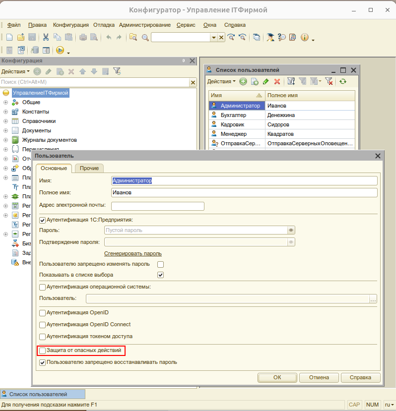
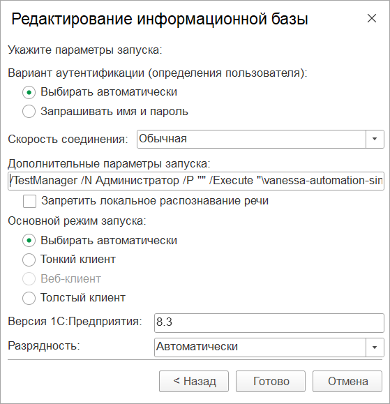
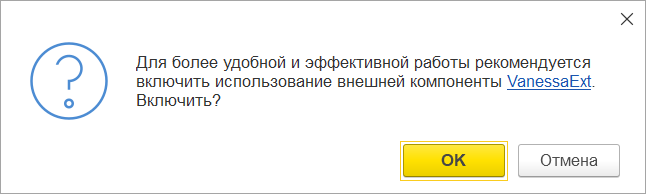
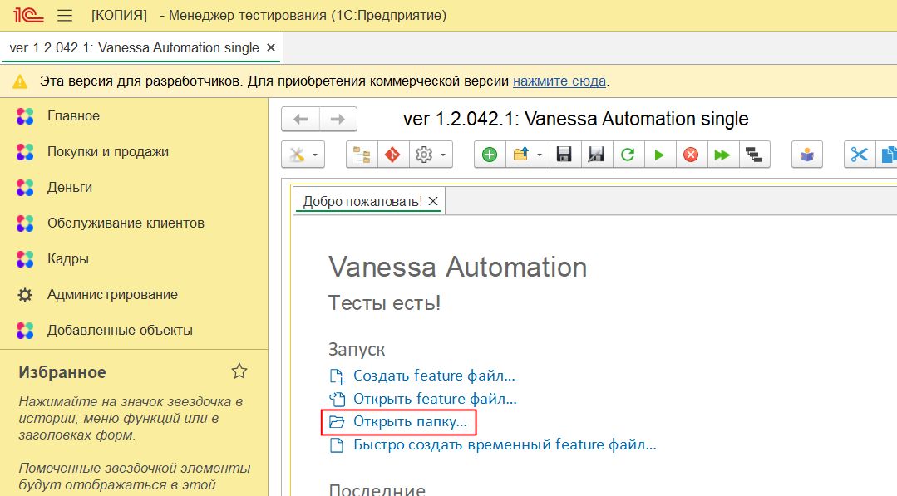
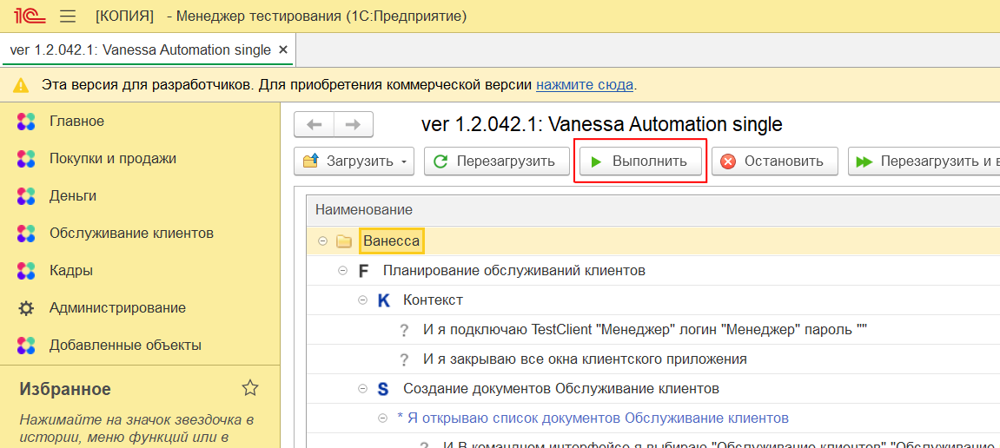

# Инструкция по запуску сценариев автоматизированного тестирования

1. Используйте выгрузку информационной базы [neto_diplom_1.0.0.3.dt](https://github.com/AlexanderV823/neto_diplom/releases/download/untagged-866ae6f094c64bc9c12f/neto_diplom_1.0.0.3.dt) для проведения автоматического тестирования. Данная выгрузка содержит необходимые элементы справочников, для возможности выполнения сценариев автоматизированного тестирования.
   
2. Сохраните [все](https://github.com/AlexanderV823/neto_diplom/tree/main/testing) сценарии автоматизированного тестирования и эталон отчета Анализ выставленных актов в один каталог.
   
3. Скачайте фреймворк Vanessa Automation из [официального](https://pr-mex.github.io/vanessa-automation/dev/) git-репозитория. Допустимо использовать single-версию. Разместите в удобном Вам каталоге.
   
4. Настройте тестовую базу для работы с библиотекой тестирования Vanessa Automation. Для этого нужно снять безопасный режим в режиме конфигуратора (Администрирование – Пользователи - Администратор).

1. Укажите в настройках базы параметры запуска: /TestManager /N Администратор /P "" /Execute "<путь до вашего каталога>/vanessa-automation-single.epf".
   

6. Запустите информационную базу в режиме 1С:Предприятие.
   
7. Во всплывающем окне согласитесь с использованием внешней компоненты VanessaExt.

8. На вкладке «Добро пожаловать!» нажмите «Открыть папку» и выберите ранее созданный каталог со сценариями.

9. Запустите выполнение сценариев.

10.  В случае успешного завершения сценариев Vanessa Automation подаст соответствующее сообщение. В противном случае, обратитесь к [разработчику](https://github.com/AlexanderV823).